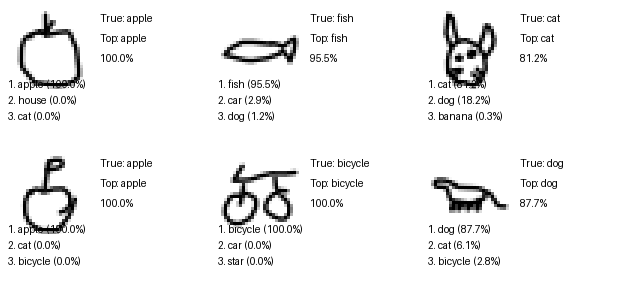
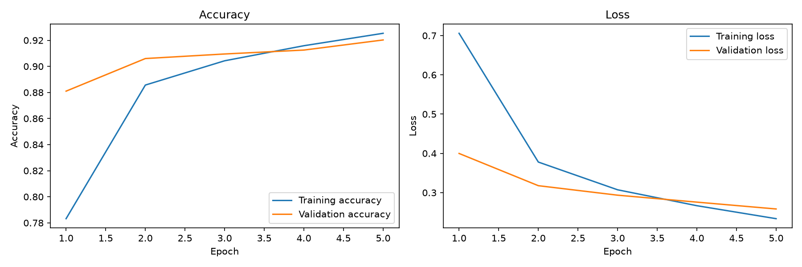
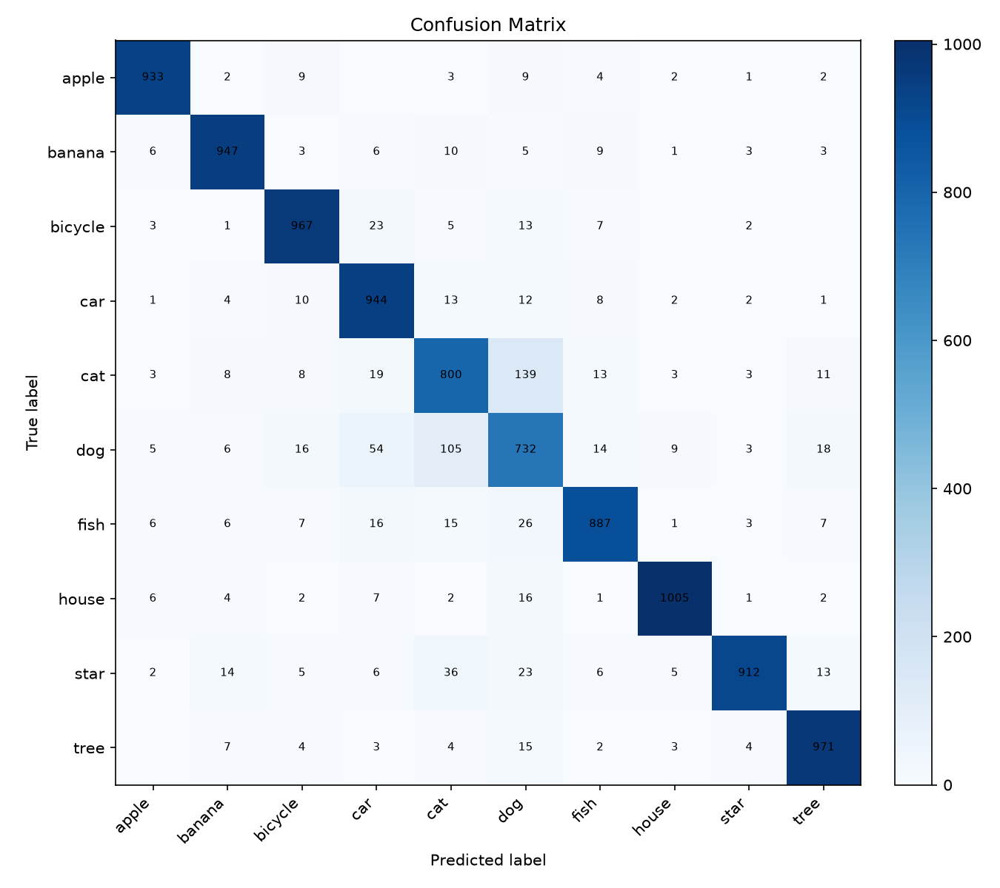

# SketchGuess AI

SketchGuess AI is an interactive doodle-recognition web app built with Streamlit and TensorFlow/Keras. Users draw one supported object on a canvas, and a small convolutional neural network returns its top three guesses with confidence scores.

The project combines a reproducible machine learning pipeline with a friendly showcase interface. If a trained model is unavailable, the app keeps working through a clearly labelled dummy-prediction fallback.



## Key Features

- Interactive drawing canvas with clear and predict controls
- Top three object predictions with confidence bars
- Correct/Wrong feedback and session accuracy tracking
- Trained-model and dummy-fallback status display
- Expandable model information using saved training metrics
- Reproducible download, training, evaluation, and preview scripts
- Confusion matrix, learning curves, and sample-prediction assets

## How It Works

1. The user draws a simple object on the Streamlit canvas.
2. The canvas image is converted to grayscale and checked for visible strokes.
3. The drawing is cropped, resized to `28x28`, normalized, and reshaped for the CNN.
4. The trained model calculates a probability for each supported class.
5. The app displays the three classes with the highest confidence.
6. The user marks the result Correct or Wrong to update the session score.

## Tech Stack

| Area | Tools |
| --- | --- |
| Application | Python, Streamlit, streamlit-drawable-canvas |
| Machine learning | TensorFlow, Keras |
| Data processing | NumPy, Pillow |
| Evaluation | Matplotlib |
| Dataset download | Requests |

## Dataset

The model is trained on NumPy bitmap files from the [Google Quick, Draw! dataset](https://github.com/googlecreativelab/quickdraw-dataset). Quick, Draw! contains millions of sketches across hundreds of categories; this project intentionally uses a smaller 10-class subset to keep training approachable and the demo lightweight.

Supported classes:

```text
apple, banana, bicycle, car, cat, dog, fish, house, star, tree
```

The download script retrieves the public `.npy` bitmap file for each selected class. Training uses a limited sample from each file rather than loading the entire dataset into memory.

## ML Pipeline

1. **Download data** with `scripts/download_quickdraw_data.py`.
2. **Prepare drawings** as grayscale `28x28x1` arrays with values from 0 to 1.
3. **Train the CNN** with two convolution and pooling stages followed by dense classification layers.
4. **Evaluate the model** on a held-out test split and save metrics and visualizations.
5. **Run prediction checks** on random raw samples with `scripts/test_prediction.py`.
6. **Launch Streamlit** and use the saved model for live drawings.

The current reference run used 5,000 samples per class for 5 epochs and achieved approximately **90.98% test accuracy** with **0.2726 test loss**. Results can vary slightly between environments.

## Evaluation Assets

### Training History



### Confusion Matrix



### Sample Predictions


These images are generated by the training and prediction-test scripts and are kept in Git because they provide useful portfolio and evaluation context.

## Installation

The commands below use Windows PowerShell. From the project folder:

```powershell
python -m venv .venv
.\.venv\Scripts\Activate.ps1
python -m pip install --upgrade pip
pip install -r requirements.txt
```

Download the selected Quick, Draw! files:

```powershell
python scripts/download_quickdraw_data.py
```

Files are stored in `data/raw/`. Existing files are skipped automatically.

## Training

For a quick pipeline check:

```powershell
python scripts/train_model.py --samples-per-class 1000 --epochs 2
```

For the default full showcase training run:

```powershell
python scripts/train_model.py
```

The default run uses 5,000 samples per class and 5 epochs. It produces:

```text
model/sketch_model.keras
model/class_names.json
model/metrics.json
assets/training_history.png
assets/confusion_matrix.png
```

Evaluate several random examples and generate the sample preview:

```powershell
python scripts/test_prediction.py
```

## Run the App

```powershell
streamlit run app.py
```

Open the local URL printed by Streamlit, normally `http://localhost:8501`.

## Project Structure

```text
sketchguess-ai/
|-- app.py                         # Streamlit page flow
|-- README.md                      # Setup, architecture, and results
|-- PROJECT_SUMMARY.md             # One-page portfolio overview
|-- requirements.txt
|-- assets/                        # Tracked evaluation images
|-- data/
|   `-- raw/                       # Downloaded data, ignored by Git
|-- model/
|   |-- class_names.json           # Small, useful model metadata
|   |-- metrics.json               # Small, useful evaluation metadata
|   `-- sketch_model.keras         # Generated model binary, ignored by Git
|-- notebooks/
|-- scripts/
|   |-- download_quickdraw_data.py
|   |-- test_prediction.py
|   `-- train_model.py
`-- src/
    |-- config.py
    |-- predict.py
    |-- preprocessing.py
    `-- ui_helpers.py
```

## Git and Generated Files

The downloaded raw data, virtual environment, Python caches, and trained `.keras`/`.h5` binaries are ignored because they are large or environment-specific. The small `model/class_names.json` and `model/metrics.json` files are allowed in Git so visitors can inspect the class order and reference evaluation results. Evaluation images in `assets/` are also tracked for the README.

A fresh clone still works without the trained binary by using the dummy fallback. Run the download and training commands to recreate the real model locally.

## Limitations

- The model recognizes only the 10 listed categories.
- Quick, Draw! samples are simplified sketches and may differ from a user's drawing style.
- Similar silhouettes can be confused, especially when drawings are incomplete.
- Confidence scores are model probabilities, not guarantees of correctness.
- Session scores reset when the Streamlit session ends.
- The trained model binary is not stored in Git and must be recreated locally.

## Future Improvements

- Add carefully selected categories after validating accuracy and class balance.
- Use data augmentation to improve robustness to different drawing styles.
- Compare the small CNN with transfer learning or lightweight mobile architectures.
- Add probability calibration and deeper error analysis.
- Package a release model through GitHub Releases or external model storage.

## Manual Testing Checklist

- [ ] The Streamlit app starts without errors.
- [ ] The drawing canvas accepts strokes and Clear resets it.
- [ ] Predict on an empty canvas shows the warning message.
- [ ] The trained model badge appears when model files are available.
- [ ] Three predictions and confidence bars appear after drawing.
- [ ] Correct/Wrong updates attempts, correct count, and accuracy.
- [ ] The Model info section opens and shows saved metrics.

## Credits

- Dataset: [Google Quick, Draw!](https://github.com/googlecreativelab/quickdraw-dataset) by Google Creative Lab
- App framework: [Streamlit](https://streamlit.io/)
- Machine learning framework: [TensorFlow/Keras](https://www.tensorflow.org/)

This project is an educational portfolio demonstration built from publicly available Quick, Draw! bitmap data.
